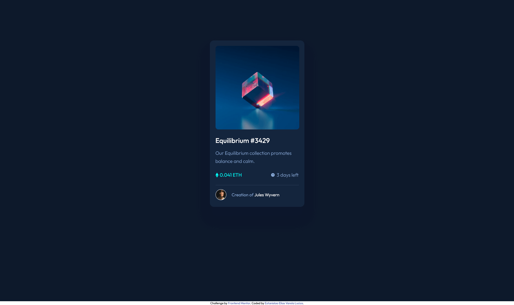
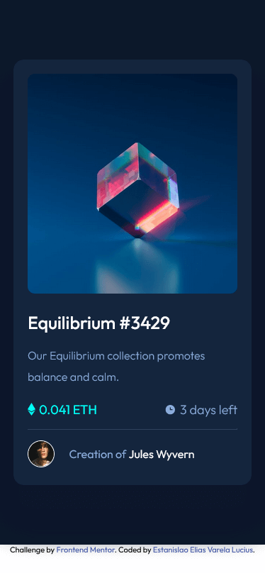

# Frontend Mentor - NFT preview card component solution

This is a solution to the [NFT preview card component challenge on Frontend Mentor](https://www.frontendmentor.io/challenges/nft-preview-card-component-SbdUL_w0U). 

## Table of contents

- [Overview](#overview)
  - [The challenge](#the-challenge)
  - [Screenshot](#screenshot)
  - [Links](#links)
- [My process](#my-process)
  - [Built with](#built-with)
  - [What I learned](#what-i-learned)
  - [Continued development](#continued-development)
- [Author](#author)

## Overview

### The challenge

Users should be able to:

- View the optimal layout depending on their device's screen size.
- See hover states for interactive elements.

### Screenshot

Desktop:

Mobile:

 

### Links

- Solution URL: [link](https://github.com/EstanisEVL/nft-preview-card-component)
- Live Site URL: [link](https://estanisevl.github.io/nft-preview-card-component/)

## My process

### Built with

- HTML5
- CSS custom properties
- Flexbox
- Mobile-first workflow
- SASS
- Node.js
- GIT

### What I learned

Thanks to this challenge I learned to work with background image overlays in CSS combined with the hover pseudoclass to create an animated transition.

### Continued development

I would like to continue focusing on the box-shadow effect to be able to more accurately reproduce the design provided.

## Author

- Github - [Estanislao Elias Varela Lucius](https://github.com/EstanisEVL)
- Frontend Mentor - [@EstanisEVL](https://www.frontendmentor.io/profile/EstanisEVL)
